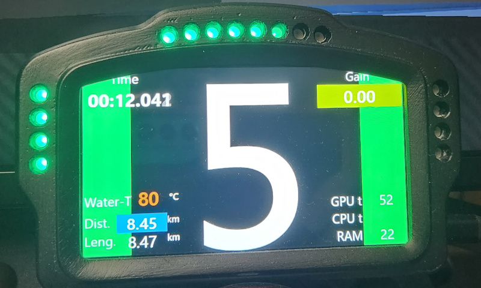
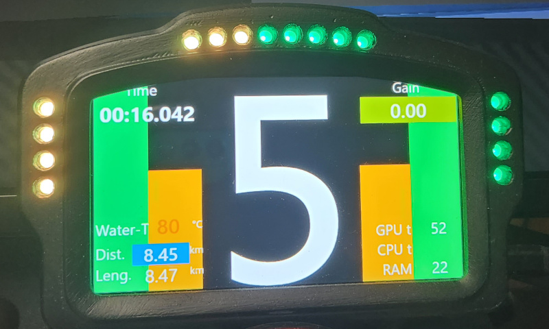
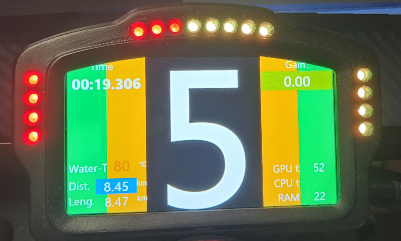
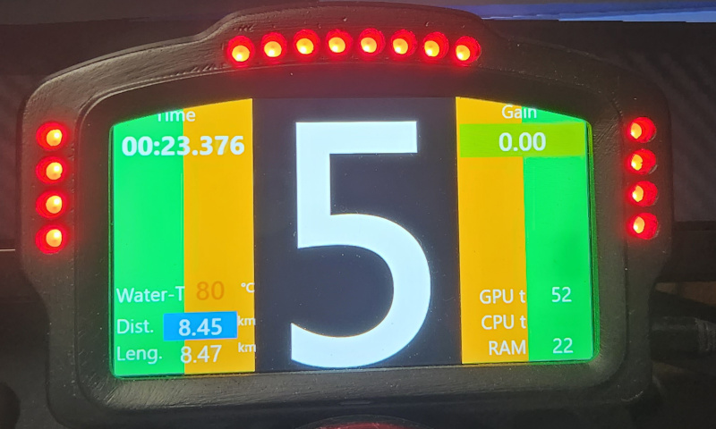
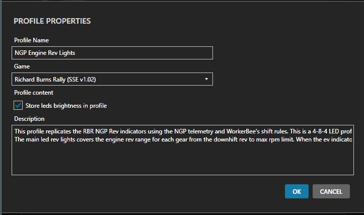

# Simhub LED Profile - RBR-NGP Telemetry Rev and Gear Change Indicators
This is a Simhub LED profile for Richard Burns Rally drivers using DDUs with LED rev/flag lights. This LED profile implements the NGP gear change indicators and also supports down-shift indication.

## Overview

Workerbee's NGP plugin provides the telemetry data needed to display the gear change indicators displayed in the in-game dash:

The NGP logic for calculating the gear change indicators are described in [Workerbee's forum post](http://www.ly-racing.de/viewtopic.php?t=7928). According to Workerbee, the ideal gear change point is Red-Yellow.

This Simhub LED profile will use the left and right led flag lights on your DDU to replicate the in-game gear change lights. Additionally, the engine rev indicator is programmed to use the same gear-change logic to transition from Green up to the Red-Red shift point. Additionally, the NGP telemetry down-shift RPM is used for the start of the Green rev light range. When the engine rev lights are completely unlit (no Green lights at all), the engine RPMs are below the down-shift point for that car & gear.

Video of this LED Profile in action: [Youtube](https://youtu.be/1eHaPtXr-ZM)

## Profile notes

The provided led profile is intended to be used with a 4-8-4 LED schema. Feel free to adjust this profile for other DDUs with a different number of leds.

This profile depends on RBR NGP telemetry. It will not work with any other driving game or with the vanilla RBR game.

## Install

In Simhub, create a new Arduino RGB LEDs profile and configure it for Richard Burns Rally:

Then download the [latest release of this led profile](https://github.com/Solarahawk/Simhub-RBR-NGP-Telemetry-Rev-Gear-Change-LEDs/releases/latest). Import this LED settings file into your new RBR profile.

